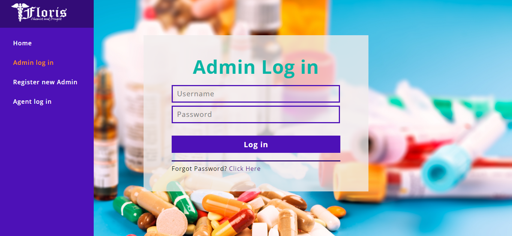
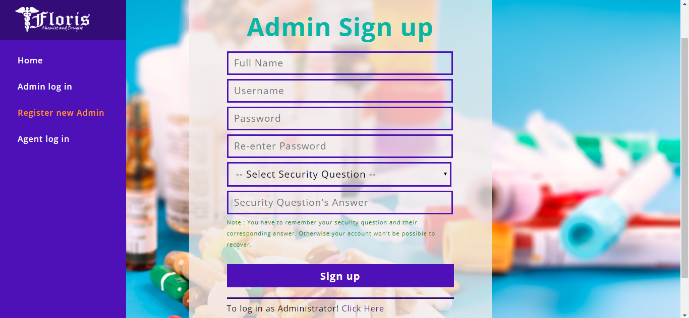
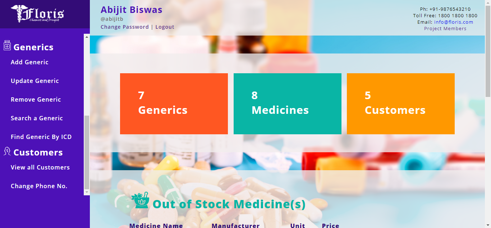
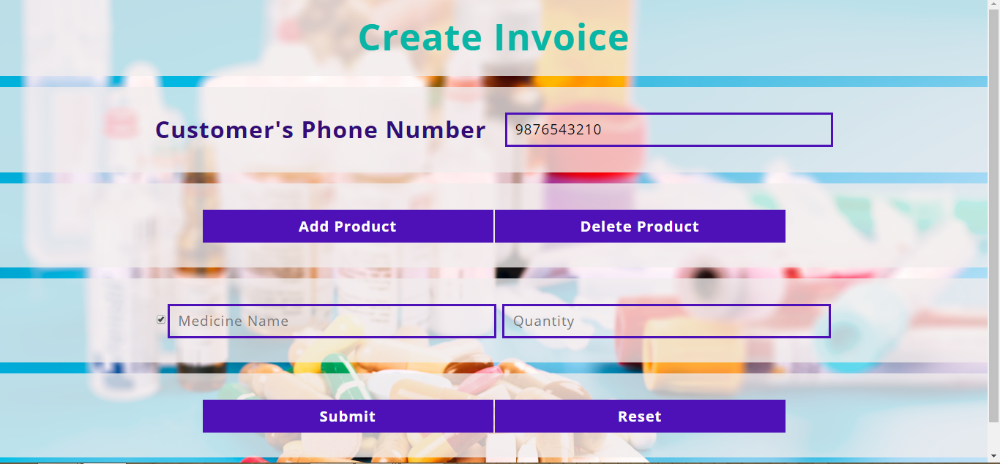

# product-management-and-billing-system-PHP
It's an product management and billing system. It have two kind of users i.e. Admin and Agent. Admin has all the control. Agent can only see products and make bill. And Customer can scan the QR code get billing details. PS- the product I focused on is MEDICINE

-----------------------
Language - PHP

-----------------------

#Screenshots

Admin Login page

Admin Signup page

Home page

Make Bill page

---------------------------------
Database name - floris

database is in DATABASE folder.

-----------------------
Admin Verifiication Code - F2204S

admin user - admin

admin pass - admin123

security question - birth year

ans - 1996

---------------------------
Agent user - agent

Agent pass - agent123

"agent123" is default pasword while adding a new agent.

security question - birth year

ans - 1997
